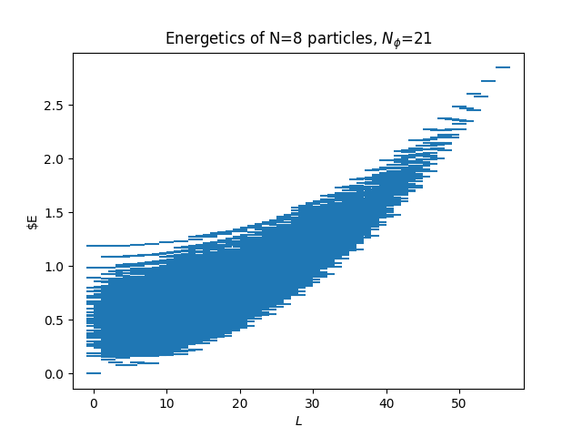
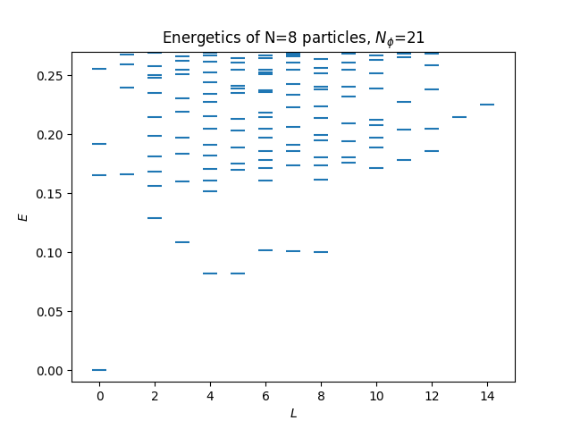

# Exact-Diagonalization-FQHE
This is a Python script for simulating the fractional quantum Hall effect (FQHE) in spherical geometry using exact diagonalziation techniques, created in part for my thesis.

The script uses the analytic form of pair pseudopotentials as derived by Elizabeth Wooten to build the Coulomb interaction Hamiltonian for the FQHE states. The program also allows for user defined pseudopotential values to generate the zero-energy unqiue state to calculate the overlap of trial waverfunction eigenstates with the Coulomb Hamiltonian eigenstates.






## Example Usages
In terminal, working in the directory of the program folder. Example of generating the energy spectrum (organized by angular momentum L) for 6 electrons in the v=1/3 state in the 0th Landau level (Nphi=15 flux quanta):

```
PATH/TO/modules/FQHE_EnergySpectrumL2.sh -e 6 -p 15 -n 0 -m 3 -w L
```

To calculate the overlap of the trial wavefunction with the Coulomb eigenstates, first generate the trial pseudopotential terms for the unique zero-energy state:

```
PATH/TO/modules/FQHE_TrialPseudopotential.sh -p 15 -v 0:2:1:1
```

Where --Vm takes multiples of 2 inputs, each divided by the delimiter ':'. The first value is the position of the custom Vm value followed by the value of Vm. The above code generates the pseudopotentials Vm= 2 1 0 0 0 0 0 0 0 0 0 0 0 0 0 0. Then, running the below script will calculate the overlap.

```
PATH/TO/modules/FQHE_EigenstateOverlap.sh -e 6 -p 15 -n 0 -m 3 -w L
```

## References
Wooten, Rachel Elizabeth, "Haldane pseudopotentials and Landau level mixing in the quantum Hall effect. " PhD diss., University of Tennessee, 2013.
https://trace.tennessee.edu/utk_graddiss/1796
